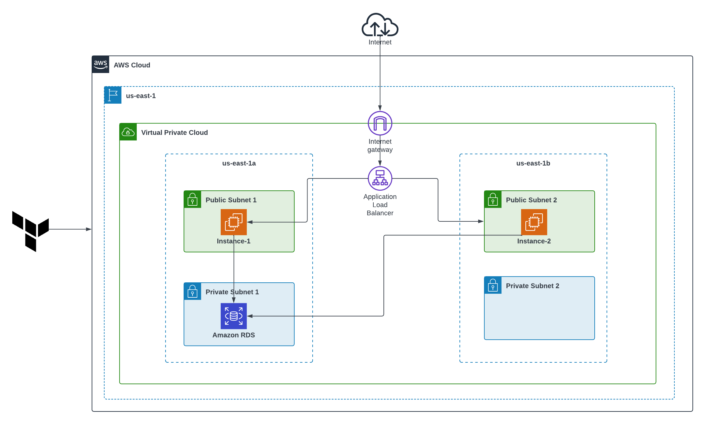

# Two-Tier AWS Architecture using Terraform

## Project Description 
This project aims to create a robust highily available web application infrastructure using a two-tier architecture on Amazon Web Services (AWS). The architecture comprises a web tier that handles user requests and a database tier for data storage. I leveraged Terraform for Infrastructure as Code (IaC) to provision and manage AWS resources efficiently.

## Architectural Diagram 




## Key Features

- **Infrastructure as Code (IaC):** Leveraging Terraform for defining and provisioning the entire infrastructure, ensuring consistency and repeatability.
- **High Availability:** Utilized multiple Availability Zones (AZs), the application is designed for high availability, minimizing downtime in case of failures.
- **Security:** Implementing security best practices, such as network ACLs, security groups, and encryption, to protect data and resources.
- **Database Management:** A managed database service  Amazon RDS is used to store and manage application data, providing reliability and data durability.
- **Load Balancing:** Employing Elastic Load Balancers (ELBs) to distribute incoming traffic across multiple web servers, optimizing resource utilization.

## Prerequistes
1. Basic knowledge of AWS services and concepts.<br>
2. Familiarity with Terraform and infrastructure as code principles.<br>
3. An AWS account with appropriate permissions.<br>
4. An IDE of your Choice , I would suggest VS Code Editor .<br>

## Terraform Configuration

The Terraform configuration files with(`*.tf`) in this repository define the AWS resources and settings required to create the two-tier architecture AWS infrastructure.

## Step-by-Step Execution

### Step 1: Environment Setup

- Install and configure AWS CLI using `aws configure`.
- Install Terraform following official documentation.
- Clone or create your Terraform project in a folder and open it using your IDE.

---

### Step 2: Initialize Terraform

Run `terraform init` to initialize the Terraform working directory and download AWS provider plugins.

---

### Step 3: Create the Network (VPC)

- Define a custom VPC with a CIDR block (e.g., 10.0.0.0/16).
- Create public subnets (for EC2) and private subnets (for RDS).
- Attach an Internet Gateway to the public subnets and optionally a NAT Gateway for private internet access.
- Configure route tables for both subnet types.

---

### Step 4: Define Security Groups

- Web Tier Security Group:
  - Inbound: Allow HTTP (80), HTTPS (443), and SSH (22)
  - Outbound: All
- Database Tier Security Group:
  - Inbound: Allow only from the Web Tier SG on database port (e.g., 3306 for MySQL)
  - Outbound: All

---

### Step 5: Create the Application Load Balancer

- Deploy an Application Load Balancer in the public subnets.
- Configure listener rules (port 80) pointing to a Target Group.
- Register EC2 instances with the Target Group.

---

### Step 6: Deploy EC2 Instances (Web Tier)

- Launch EC2 instances in public subnets with a startup script to install a web server (Apache, NGINX, etc.).
- Associate proper security groups and IAM roles.

---

### Step 7: Provision RDS Database (Private Subnet)

- Create an RDS DB instance (MySQL or Postgres) in private subnets.
- Disable public access to the RDS.
- Use security group to allow only internal traffic from web tier.

---

### Step 8: Variable Management

- `variables.tf`: Declare input variables like region, instance types, AMIs, etc.
- `terraform.tfvars`: Provide actual values for those variables.
- Use these to keep your code modular and environment independent.

---

### Step 9: Apply the Configuration

Run the following:

```bash
terraform plan
terraform apply
```

This will:
- Create the entire network
- Provision EC2 and RDS
- Deploy the Load Balancer
- Output useful details such as DNS of the ALB

---

### Step 10: Final Output

After successful execution of `terraform apply`, you will get an output similar to:

```
Outputs:

load_balancer_dns_name = "my-loadbalancer-1234567890.us-east-1.elb.amazonaws.com"
```

This DNS link can be opened in your browser to access the deployed web application.

---

## Clean Up

To tear down all AWS resources created by Terraform:

```bash
terraform destroy
```

Ensure this is done to avoid incurring unnecessary AWS charges.

---

## Security Considerations

- Never hardcode AWS credentials or secrets in Terraform code.
- Avoid exposing RDS instances to public internet.
- Use encryption for both EC2 volumes and RDS storage.
- Prefer IAM roles over using access keys on EC2.
- Use S3 + DynamoDB for remote state and locking in production environments.

---

## Use Cases

- Deploying production/staging environments.
- Hands-on DevOps and cloud automation practice.
- Creating reliable web infrastructure using Terraform.
- Educational purposes for understanding AWS networking and provisioning.

---

## Next Steps

- Add Auto Scaling for web tier.
- Integrate CloudWatch monitoring.
- Secure secrets using AWS Secrets Manager.
- Implement CI/CD using Jenkins or GitHub Actions.
- Store Terraform state in S3 backend with state locking using DynamoDB.

---

## Contributions

Pull requests and issue reports are welcome. Please follow standard GitHub contribution practices

